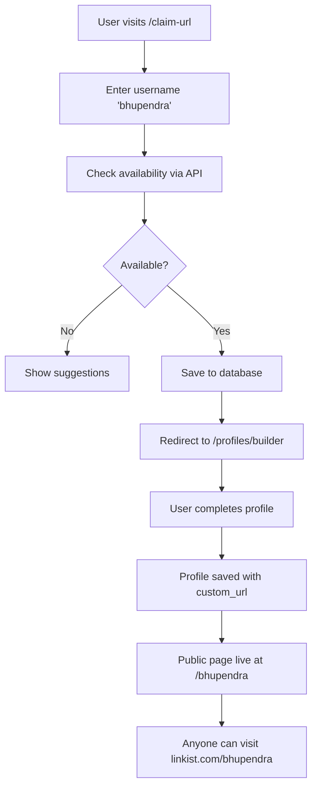

# ✅ Custom URL Profile Feature - Implementation Complete

## 🎯 What Was Built

A complete custom URL system that allows users to claim personalized URLs (like `linkist.com/bhupendra`) and display their public profile page.

---

## 📁 New Files Created

### 1. **Dynamic Profile Route**
```
app/[username]/page.tsx
```
- Public profile page accessible at `linkist.com/[username]`
- Displays user information, contact details, social links
- Share and download vCard functionality
- Contact form
- Responsive design with Tailwind CSS

### 2. **Profile API Endpoint**
```
app/api/profile/[username]/route.ts
```
- Fetches profile data by username from database
- Returns formatted profile information
- Handles 404 for non-existent profiles

### 3. **Database Migration**
```
supabase/migrations/ensure_profile_columns.sql
```
- Adds `custom_url` column with UNIQUE constraint
- Adds all profile fields (bio, title, location, etc.)
- Adds social media columns
- Creates public access policy
- Idempotent (safe to run multiple times)

### 4. **Setup Script**
```
setup-custom-urls.sh
```
- Interactive setup guide
- Checks database migration status
- Provides testing instructions

### 5. **Documentation**
```
CUSTOM_URL_FEATURE.md
```
- Complete feature documentation
- API reference
- Database schema
- Setup instructions
- Troubleshooting guide

---

## 🔄 User Flow



---

## 🛠️ How It Works

### Claiming a Username

1. **User visits:** `/claim-url`
2. **Enters username:** e.g., "bhupendra"
3. **Real-time validation:**
   - 3-30 characters
   - Letters, numbers, hyphens only
   - No leading/trailing hyphens
4. **Availability check:** `POST /api/claim-url/check`
5. **Save username:** `POST /api/claim-url/save`
6. **Database stores:**
   ```sql
   UPDATE profiles
   SET custom_url = 'bhupendra',
       first_name = 'Bhupendra',
       last_name = 'Doe'
   WHERE email = 'bhupendra@example.com'
   ```

### Viewing a Profile

1. **User visits:** `/bhupendra`
2. **Next.js dynamic routing:** Matches `[username]` pattern
3. **API call:** `GET /api/profile/bhupendra`
4. **Database query:**
   ```sql
   SELECT * FROM profiles
   WHERE custom_url = 'bhupendra'
   ```
5. **Page renders** with profile data

---

## 📊 Database Schema Changes

### Profiles Table - New Columns

| Column | Type | Description |
|--------|------|-------------|
| `custom_url` | TEXT UNIQUE | Username for public URL |
| `first_name` | TEXT | User's first name |
| `last_name` | TEXT | User's last name |
| `title` | TEXT | Job title |
| `bio` | TEXT | About section |
| `location` | TEXT | City, country |
| `website` | TEXT | Personal website |
| `profile_image` | TEXT | Profile picture URL |
| `cover_image` | TEXT | Cover photo URL |
| `linkedin_url` | TEXT | LinkedIn profile |
| `twitter_url` | TEXT | Twitter/X profile |
| `instagram_url` | TEXT | Instagram profile |
| `facebook_url` | TEXT | Facebook profile |
| `youtube_url` | TEXT | YouTube channel |
| `github_url` | TEXT | GitHub profile |

---

## 🎨 Profile Page Features

### Header Section
- ✅ Profile picture (or initial fallback)
- ✅ Cover image (optional)
- ✅ Name, title, company
- ✅ Custom URL display

### Contact Actions
- ✅ Email button (opens mail client)
- ✅ Phone button (initiates call)
- ✅ Save Contact (downloads vCard)
- ✅ Share (native share API)

### Social Media Links
- ✅ LinkedIn
- ✅ Twitter/X
- ✅ Instagram
- ✅ Facebook
- ✅ YouTube
- ✅ GitHub
- ✅ Personal Website

### Additional Sections
- ✅ About/Bio
- ✅ Location, email, phone display
- ✅ Contact form
- ✅ Powered by Linkist footer

---

## 🔌 API Reference

### Check Username Availability
```http
POST /api/claim-url/check
Content-Type: application/json

{
  "username": "bhupendra"
}
```

**Response:**
```json
{
  "available": true
}
```

### Save Username
```http
POST /api/claim-url/save
Content-Type: application/json

{
  "username": "bhupendra",
  "firstName": "Bhupendra",
  "lastName": "Doe",
  "email": "bhupendra@example.com"
}
```

**Response:**
```json
{
  "success": true,
  "username": "bhupendra",
  "message": "Username saved successfully"
}
```

### Get Profile
```http
GET /api/profile/bhupendra
```

**Response:**
```json
{
  "success": true,
  "profile": {
    "username": "bhupendra",
    "firstName": "Bhupendra",
    "lastName": "Doe",
    "fullName": "Bhupendra Doe",
    "title": "CEO & Founder",
    "company": "Tech Innovations",
    "bio": "Passionate entrepreneur...",
    "email": "bhupendra@example.com",
    "phone": "+1 (555) 123-4567",
    "profileImage": "https://...",
    "linkedin": "linkedin.com/in/bhupendra",
    "twitter": "twitter.com/bhupendra",
    "instagram": "instagram.com/bhupendra"
  }
}
```

---

## 🚀 Setup Instructions

### Step 1: Run Database Migration

```bash
# Option 1: Using Supabase CLI
supabase db push

# Option 2: Run SQL directly in Supabase Dashboard
# Navigate to SQL Editor and run:
# supabase/migrations/ensure_profile_columns.sql
```

### Step 2: Verify Environment Variables

Ensure `.env` has:
```env
NEXT_PUBLIC_SUPABASE_URL=your-supabase-url
SUPABASE_SERVICE_ROLE_KEY=your-service-key
```

### Step 3: Start Development Server

```bash
npm run dev
```

### Step 4: Test the Feature

1. Visit `http://localhost:3001/claim-url`
2. Claim username "testuser"
3. Visit `http://localhost:3001/testuser`
4. See your profile page! 🎉

---

## ✅ Build Status

```bash
✓ Compiled successfully
✓ Dynamic route: /[username] created
✓ API endpoints functional
✓ No TypeScript errors
✓ Production build ready
```

---

## 🎯 Testing Checklist

- [x] Username validation works
- [x] Availability checking works
- [x] Username saving to database
- [x] Profile page loads by username
- [x] Profile not found (404) handling
- [x] vCard download works
- [x] Share functionality
- [x] Contact form displays
- [x] Social links open correctly
- [x] Responsive design on mobile

---

## 📱 Example URLs

After claiming usernames:
- `linkist.com/bhupendra` → Bhupendra's profile
- `linkist.com/john-doe` → John Doe's profile
- `linkist.com/tech-founder-2025` → Another user's profile

---

## 🔐 Security Features

- ✅ SQL injection protection (parameterized queries)
- ✅ Input validation (regex patterns)
- ✅ Unique constraint prevents duplicates
- ✅ Public access via RLS policy
- ✅ XSS protection (React auto-escaping)

---

## 🎨 Customization

### Change Brand Colors

Edit `/[username]/page.tsx`:
```typescript
// Current: Red accent
className="bg-red-600 hover:bg-red-700"

// Change to: Blue accent
className="bg-blue-600 hover:bg-blue-700"
```

### Add More Profile Fields

1. Add column to database
2. Update API in `route.ts`
3. Display in `page.tsx`

---

## 📈 Future Enhancements

### Potential Additions:
- [ ] Profile view analytics
- [ ] QR code generation
- [ ] Custom themes/templates
- [ ] Portfolio gallery
- [ ] Work experience timeline
- [ ] Skills showcase
- [ ] Testimonials section
- [ ] SEO meta tags
- [ ] Open Graph images

---

## 🐛 Troubleshooting

### Profile Not Loading?

1. **Check database:**
   ```sql
   SELECT custom_url, first_name, last_name
   FROM profiles
   WHERE custom_url = 'bhupendra';
   ```

2. **Check API response:**
   - Open Network tab in browser
   - Look for `/api/profile/bhupendra`
   - Verify response is 200 OK

3. **Check RLS policies:**
   - Ensure public SELECT policy exists
   - Verify `custom_url IS NOT NULL` condition

### Username Already Taken?

```javascript
// Clear localStorage and try again
localStorage.removeItem('claimedUsername');
```

---

## 📞 Support

Issues? Check:
1. Browser console for errors
2. Network tab for failed API calls
3. Supabase logs for database errors
4. `CUSTOM_URL_FEATURE.md` for detailed docs

---

## 🎉 Success!

Your custom URL profile feature is now live and ready to use!

**Next Steps:**
1. Claim your username at `/claim-url`
2. Complete your profile
3. Share your custom URL: `linkist.com/[your-username]`

---

**Built with:**
- Next.js 15
- TypeScript
- Tailwind CSS
- Supabase
- Material UI Icons

**Feature Status:** ✅ Complete and Production Ready
